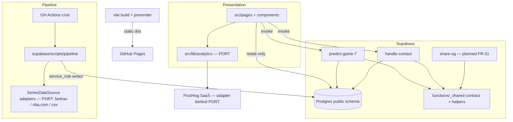

# Architecture Spine — predictgame7

## Design Paradigm

Layered SPA over a serverless core. The React app is a thin presentation layer over Supabase (Postgres reads direct, all computation and every write in Edge Functions). Two seams are deliberately pluggable because the PRD says they may swap: **analytics** (NFR-V1 — PostHog is deprecatable) and **series data source** (Q-4 — Fantrax vs. nba.com vs. manual). Those two seams get ports & adapters; everything else is convention, ratified from the existing code.



Dependency rule: arrows point one way. Pages never import `posthog-js`, never hold a service key, never write to Postgres. Pipeline scripts never import frontend code. Edge Functions share contracts via `functions/_shared`, never via `src/`.

## Invariants & Rules

### AD-1 — Analytics isolation layer  `[ADOPTED — owner confirmed 2026-09-23]`

- **Binds:** all instrumentation (FR-24, FR-25, NFR-V1); every file that today calls PostHog (`main.tsx`, `PredictPage`, `HistoricalPage`, `HomePage`, dead `AuthContext`)
- **Prevents:** vendor calls interleaved with feature code (the current state) — which makes the owner's "deprecate PostHog if no traction" exit a multi-file surgery, and lets event names drift per page
- **Rule:** one module, `src/lib/analytics/` — the only place `posthog-js` / `@posthog/react` may be imported. It exposes a typed event registry (`EVENTS` constant object with the 10 names from addendum §A.1, verbatim) and four functions: `track(event, props)`, `identify(userId)`, `resetUser()`, `captureError(err, ctx)`. Feature code imports only from `@/lib/analytics`. Provider bootstrap lives in `analytics/provider.tsx`; `main.tsx` mounts that, not PostHog directly. The module also owns the provider-agnostic **metric-query surface** for FR-25's gate figures (today: wrapping the PostHog query API / official MCP server) — NFR-V1 covers queries too, so gate numbers stay retrievable after a vendor swap. The query surface is documented and typed in this module but **executes owner-local** (CLI/MCP against the personal PostHog API key) — that key is never in the repo, the bundle, or any `VITE_*` var (NFR-S1). The SM-1 unique-visitor definition (identify/reset caveats, addendum §A.1) is pinned in this module's docs before Apr 2027. On any vendor exit, the PostHog agent-skill folder in the repo exits with it (Q-8). Swapping vendors = rewriting this module only.

### AD-2 — One prediction contract, canonical Method slugs  `[ADOPTED — slugs ratified from code]`

- **Binds:** `PredictPage`, `predict-game-7`, any future consumer of predictions (share landing, FR-26..29)
- **Prevents:** the drift found in the sweep — frontend union allows `'bayesian' | 'ensemble_v1' | 'margin_model_v1'`, the function only knows `'bayes'`; `PredictionResult` declares fields the function never returns. This class of bug is issue #3's territory
- **Rule:** canonical contract in `supabase/functions/_shared/contract.ts`: `MethodSlug = 'logistic_regression' | 'bayes' | 'elo' | 'exponential_smoothing'`, `PredictionInput`, `PredictionResult` (fields the function actually returns: winner, per-team probabilities **as 0–100 percent** — the scale the function ships today — contributing factors, confidence, computation time, method_used). The contract is also the single owner of the **share payload schema** (`SharePayload` + its url-safe base64 encoding, AD-6) so the Share button and `share-og` can never derive divergent shapes. Frontend `src/types/prediction.ts` re-exports it via type-only import; the stale unions in `src/types/types.ts` are deleted. Adding a Method = extend the union + Maths page (FR-15) + event registry in the same change.

### AD-3 — Edge Function runtime convention

- **Binds:** `predict-game-7`, `handle-contact`, any new function (`share-og`, FR-17 notification path)
- **Prevents:** two coexisting runtimes — `predict-game-7` uses `Deno.serve` + `jsr:@supabase/supabase-js@2`, `handle-contact` uses legacy `deno.land/std@0.168.0` `serve` + `esm.sh`
- **Rule:** `Deno.serve` + `jsr:` imports only; shared code in `supabase/functions/_shared/` (CORS handler, `jsonResponse`, `contract.ts`, service-role client factory). `handle-contact` migrates to this shape as part of FR-17 work. FR-17's delivery notification calls **Resend** from `handle-contact` (or its successor) only — the Resend API key is a Supabase function secret, never a `VITE_*` var (NFR-S1); free tier required (PRD §6). Error responses use one envelope: `{ "error": string }` with appropriate HTTP status; never stack traces.

### AD-4 — `series.status` domain  `[ADOPTED — owner decision 2026-09-23: two values only]`

- **Binds:** `series` table, FR-2/FR-11/FR-21 acceptance, pipeline writes, archive UI
- **Prevents:** every consumer inventing its own Active-vs-Historical test (the PRD flags the domain as undefined; a prior three-value attempt caused problems)
- **Rule:** `status text NOT NULL CHECK (status IN ('active','completed'))`. A series row **exists only once it is active** — the pipeline creates it when the matchup tips off (or is set to tip off that day); not-yet-started series are simply absent, which is why FR-2's Active list is naturally empty outside the playoffs. **Active Series** (FR-2) = `status = 'active'`; **Historical Archive** (FR-10/11) = `status = 'completed'`. Only pipeline scripts (AD-5) and migrations write `status`. **Migration sequencing (the live DB disagrees today):** the existing schema carries a three-value `chk_series_status` CHECK with `DEFAULT 'historical'` (migration 00005) and `HistoricalPage` queries `.eq('status','historical')`. One numbered migration must: drop/replace `chk_series_status`, remove the `'historical'` default, backfill all existing rows `'historical' → 'completed'`, then apply the two-value CHECK — and the frontend query + type flip to `'completed'` ships in the **same release** (migration applied immediately before the `gh-pages` deploy), scheduled **outside the playoff window** so the brief archive-dark window between migration and deploy hits zero traffic. Update `docs/CURRENT_DATA_MODEL.md` in the same commit.

### AD-5 — Pipeline: CI-scheduled scripts behind a data-source port  `[ADOPTED — owner confirmed 2026-09-23; adapter internals still pending Q-4 spike]`

- **Binds:** FR-19/20/21, NFR-D1, SM-4
- **Prevents:** pipeline logic fusing to one unverified vendor (Fantrax may not pan out — spike is a build prerequisite), and silent staleness during the playoff window (which would invalidate the SM-1 measurement itself)
- **Rule:** GitHub Actions scheduled workflow(s) — offseason mode (playoff start/end) and inseason mode (daily during playoffs) — running scripts under `supabase/scripts/pipeline/`, `service_role` key from GH Actions secrets only. All source access goes through a `SeriesDataSource` port (`fetch_series_statuses`, `fetch_game_scores`); adapters: `fantrax`, `nba_com`, `manual_csv` (the spreadsheet precedent), selected by env var. Writes are idempotent upserts — but `(year, round)` only becomes a real key when a prerequisite migration adds `UNIQUE (year, round)` on `series` **and** pins `round`'s domain with a CHECK constraint (today `round` is free TEXT with no enumeration; without both, adapters silently duplicate rows). Game scores upsert on `(series, game_number)`; status writes follow AD-4. The pipeline also owns `insights_cache` refresh (FR-12): recompute on each offseason run and on inseason runs that complete a series. A failed run must fail loudly — non-zero exit so GitHub's failed-run notification reaches the owner (SM-4's detection mechanism; richer alerting deferred) — never partially applied silence.

### AD-6 — Sharing: site deep-links + edge-rendered OG  `[ADOPTED — owner constraint: zero extra cost; this design adds no vendor and runs on the existing Supabase free tier]`

- **Binds:** FR-31, FR-25 (share attribution), SM-3, addendum §D SEO play
- **Prevents:** two incompatible share mechanisms (screenshot-only vs. link) and per-vendor OG hacks; GitHub Pages cannot vary `<meta>` per URL, so any design assuming it can is dead on arrival
- **Rule:** a Share Link is a site deep-link that fully encodes the prediction: `/series/<id>?method=<slug>` for archive series (the prerendered per-series route, AD-7 — query-param-only links 404 on GitHub Pages today, verified live), `/predict?custom=<url-safe base64 of {teams, scores, method}>` for Custom Matchups — opening either re-renders without re-entry. The custom-mode base64 and the share `?p=` payload both follow the `SharePayload` schema owned by `_shared/contract.ts` (AD-2). **Build chain must emit a `404.html` SPA fallback** (copy of `index.html`) so GitHub Pages serves the app on every client-rendered deep-link instead of its stock 404 — without it, all share links break as deployed. Because crawlers don't execute JS and GH Pages meta is static, the link users copy is the **`share-og` Edge Function URL** (`…/functions/v1/share-og?p=<payload>`): it serves a minimal HTML page carrying per-prediction `og:title/description/image` (card generated with `npm:@vercel/og` — satori + resvg, Supabase's current official OG-image pattern — within free-tier invocation limits) and immediately redirects humans to the site deep-link with `utm_source=share` (FR-25 attribution). `share-og` is **anonymous/public — no JWT verification**; a crawler hitting it with no auth header must get a 200 (its only inputs are the signed-by-obscurity payload and public series data). Crawlers keep the meta; users land on the site in about a second (unverified against Edge Function CPU limits — measure in the FR-31 spike). The site's static `index.html` keeps generic fallback meta. Rejected (cost/vendor): prerender SaaS, Vercel OG hosting.

### AD-7 — SEO: build-time prerender for the historical archive  `[ADOPTED — owner confirmed 2026-09-23; content scope fixed below]`

- **Binds:** FR-10/11 surfaces, addendum §D "evergreen historical pages rank year-round", pre-playoff release scope §8.1
- **Prevents:** a client-rendered SPA that Google indexes as one page — the 177-series archive is the SEO asset and is fully known at build time
- **Rule:** the deploy build emits one static HTML per historical series route — the route scheme is `/series/<id>` prerendered to `dist/series/<id>/index.html`, plus `dist/404.html` as the SPA fallback for everything else (AD-6) — via a prerender step in the `predeploy` chain, route list generated from the DB at build time. **Prerendered content = series facts, not predictions:** real `<title>`/description/OG meta (year, round, teams, winner), the game-by-game scores table (FR-11's expanded record), and a CTA into the Predict flow with that series preloaded. Prediction outputs stay interactive/computed on demand — no model results baked at build time (a default-method bake-in is a possible later enhancement, not v1). Active-series and custom routes stay client-rendered (change too fast / unbounded). Prerendering must not fork the app: same routes, same components, hydration only — `/series/<id>` becomes a real router route the SPA also serves client-side.

### AD-8 — Data access boundary  `[ADOPTED — ratifies PRD NFR-S1 + existing code]`

- **Binds:** every frontend surface, every function, every script
- **Prevents:** a page growing a write path with the anon key (the v0.2.2 contact-hardening lesson), or service keys creeping client-side (issue #1 history)
- **Rule:** client-side = **reads only** through the single client instance `src/db/supabase.ts` (anon key, RLS enforced); pages may query directly — no intermediate data layer is introduced. **All writes/mutations** (contact intake, predictions persistence when FR-23 ships, pipeline upserts) happen only in Edge Functions or pipeline scripts holding `service_role`, never in the bundle. `predictions` stays private-by-RLS until FR-22/23 unlock it.

### AD-9 — Frontend module conventions  `[ADOPTED — ratifies dominant code patterns]`

- **Binds:** all new/changed frontend code
- **Prevents:** the small drifts the sweep found (two type files, mixed import styles, dead vestigial modules confusing agents)
- **Rule:** imports use the `@/` alias exclusively; one type barrel `src/types/` (fold `index.ts` into it); components/pages PascalCase files + default exports, `ui/`/`hooks/`/`lib/` kebab-case (existing convention). Error handling in UI stays inline try/catch + `console.error` + sonner toast (no new state library, no react-query — local state + effects is the ratified pattern). Dead vestigial modules (`AuthContext`/`RouteGuard`, `SamplePage.tsx`) are deleted when FR-22 work begins, not extended; until then they are off-limits as import targets. Forms: react-hook-form + zod is the standard **for new forms**; the existing contact form migrates when FR-17 touches it.

## Consistency Conventions

| Concern | Convention |
| --- | --- |
| Naming | Components/pages `PascalCase.tsx`; `ui/`,`hooks/`,`lib/` `kebab-case.ts`; analytics events `snake_case` (registry is the only source); DB tables/columns `snake_case` |
| IDs & data | Series identity = `(year, round)` (UNIQUE constraint + `round` CHECK domain — prerequisite migration per AD-5); game rows keyed `(series, game_number)`; Method slugs per AD-2; probabilities are 0–100 percent in the contract (AD-2), rendered with a % sign |
| API shapes | Edge Function success = the contract type as JSON body; error = `{ "error": string }` + status code; CORS via `_shared` helper |
| Errors | UI: inline try/catch + toast (sonner); functions: catch → error envelope + `captureError` via analytics layer where client-side; pipeline: non-zero exit + workflow failure |
| Config | Client env = `VITE_*` only (public by design); secrets = GH Actions secrets (pipeline) / Supabase dashboard (functions); never `.env*` in repo |
| Migrations | Numbered SQL in `supabase/migrations/`; every schema change updates `docs/CURRENT_DATA_MODEL.md` in the same commit |
| Performance | P95 ≤ 3s full-request on mobile 4G (NFR-P1, provisional until FR-25 data); `share-og` redirect target ≈ 1s — unverified against Edge Function CPU limits, measure in the FR-31 spike; prerendered archive pages carry full content in initial HTML |
| Commits & versions | Per `AGENTS.md` (imperative titles + FR/issue refs; `package.json` canonical; CHANGELOG per release) |

## Stack

SEED — verified from `package.json`/code at authoring 2026-09-23; the code owns this once changed.

| Name | Version |
| --- | --- |
| React | ^18 |
| Vite | `npm:rolldown-vite@latest` today — a **deprecated** Vite-7 shim (7.3.1); Vite 8 is Rolldown-powered, so migrate to `vite@^8` at the next dependency touch |
| @supabase/supabase-js | 2.103.1 (pinned) |
| react-router-dom | ^7.9.5 (BrowserRouter, basename `/predictgame7/`) |
| posthog-js / @posthog/react | ^1.376.4 / ^1.9.1 (behind AD-1 port) |
| Tailwind CSS | ^3.4.11 — deliberate stay on v3 (existing shadcn "new-york" + HSL token setup); v4 is current, upgrade is a standalone task, not ride-along |
| zod / react-hook-form | ^3.25.76 / ^7.66.0 (new forms standard, AD-9) |
| Biome | 2.4.5 |
| Edge runtime | Deno (`Deno.serve`, `jsr:` imports — AD-3) |
| OG rendering (planned) | `npm:@vercel/og` (satori + resvg) in the `share-og` function (AD-6) |
| Email (planned, FR-17) | Resend — free tier, server-side only (AD-3) |
| Pipeline | Node/TS or Python under `supabase/scripts/pipeline/` (AD-5; language = spike's call) |
| Hosting / CI | GitHub Pages (`gh-pages` branch) / GitHub Actions |
| DB / backend | Supabase free tier (Postgres + RLS + Edge Functions + Auth vestigial) |

## Structural Seed

```text
predictgame7/
  src/
    pages/            # route-level components (PascalCase)
    components/{ui,common,layouts}/
    db/supabase.ts    # the single anon client (AD-8)
    lib/analytics/    # THE analytics port (AD-1): registry, track/identify/reset/captureError, provider
    types/            # one barrel; prediction contract re-exported from functions/_shared (AD-2)
    routes.tsx        # data-driven route table
  supabase/
    functions/
      _shared/        # contract.ts, cors.ts, json.ts, service-client.ts (AD-2/AD-3)
      predict-game-7/ handle-contact/ share-og/   # share-og = FR-31 (AD-6)
    migrations/       # numbered SQL; status enum per AD-4
    scripts/pipeline/ # adapters + runner (AD-5); load-games/ stays as legacy precedent
  .github/workflows/  # keepalive (exists); pipeline-offseason, pipeline-inseason (AD-5); deploy
  docs/               # CHANGELOG, CURRENT_DATA_MODEL, archive/
  AGENTS.md           # standing agent instructions (companion)
```

Deployment & environments: single environment (production). `npm run build` → prerender step (AD-7, incl. `404.html` fallback) → `predeploy`/`deploy` pushes `dist` to `gh-pages`. Supabase project = production backend (free tier, keepalive cron defends it). Edge Functions deploy via Supabase CLI (`supabase functions deploy`); function secrets (Resend key, any server-side credentials) are set via `supabase secrets` / the dashboard — never in the repo or a `VITE_*` var (NFR-S1). Migrations apply via Supabase CLI/migration chain before the matching `gh-pages` deploy (AD-4 sequencing). No staging environment — verification gate is local build + lint per `AGENTS.md`; pipeline dry-runs use `manual_csv` adapter against a transaction-wrapped preview before live writes. `[ASSUMPTION: no staging is acceptable at solo scale — revisit only if the gate passes and accounts ship.]`

## Capability → Architecture Map

| Capability (PRD) | Lives in | Governed by |
| --- | --- | --- |
| Predict flow FR-1..9 | `PredictPage` + `predict-game-7` | AD-2, AD-8 |
| Archive & Insights FR-10..12 | `HistoricalPage`/`InsightsPage` direct reads | AD-8, AD-7 |
| Video FR-13 (gated) | — | Deferred |
| Content/brand/contact FR-14..18 | `HomePage`, Maths, `handle-contact` | AD-3, AD-9 |
| Pipeline FR-19..21 | `.github/workflows` + `scripts/pipeline` | AD-4, AD-5 |
| Accounts FR-22..23 (gated) | vestigial Auth today | Deferred |
| Analytics FR-24..25 | `src/lib/analytics` + PostHog assets | AD-1 |
| Betting-adjacent FR-26..29 (gated) | would extend `predict-game-7` + contract | AD-2, Deferred |
| Reliability FR-30 | tests + QA matrix | AD-2 (contract testability), AGENTS.md gate |
| Sharing FR-31 | `/series/<id>` deep-links + `share-og` + `404.html` fallback | AD-6, AD-7 |

## Deferred

- **Accounts architecture (FR-22/23)** — gated on SM-1; Supabase Auth pattern, `predictions` RLS unlock, and the fate of vestigial `AuthContext` are decided when Q-1 discovery runs. AD-9 only forbids extending the dead code meanwhile.
- **Betting-adjacent outputs (FR-26..29)** — gated; when unlocked they extend the AD-2 contract (new output fields), not a second API.
- **Video mechanism (FR-13/Q-5)** — gated; storage choice (Supabase Storage vs. external) would touch AD-8's cost ceiling.
- **Pipeline implementation language + adapter internals** — the Q-4 feasibility spike (Fantrax reachability, nba.com rate limits) picks TS-vs-Python and validates the port's method shapes; AD-5 fixes only the boundary.
- **Staging environment** — none at solo scale. **Revisit trigger: before FR-22 (accounts) implementation** — auth + RLS changes are the risky class a staging env protects. Shape when triggered: second Supabase project (free tier allows a second one; watch its inactivity-pause) + branch-based deploy target; moderate one-time setup, ongoing cost is keeping migrations and env vars synced across both projects.
- **Test framework + layout (FR-30)** — picked at the reliability build: Vitest ^4.1 supports Vite 8 (web-verified 2026-09-23), so the compatibility question resolves itself once the Vite 8 migration lands; if still on the `rolldown-vite` shim at that point, verify before binding. Manual-QA matrix artifacts live in `_bmad-output/implementation-artifacts/`.
- **Form library migration of existing contact form** — rides along with FR-17, not standalone.
- **OG card visual design** — satori template layout is a UX/brand task (voice anchors in addendum §H), not architecture.
