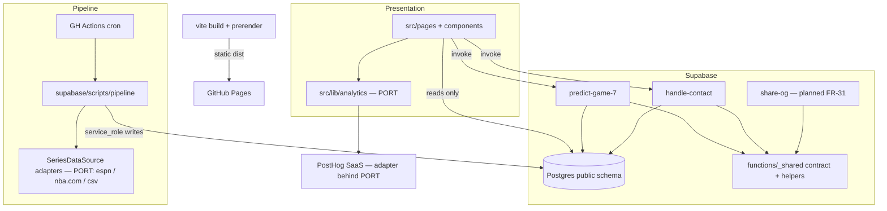

# Architecture Spine — predictgame7

## Design Paradigm

Layered SPA over a serverless core. The React app is a thin presentation layer over Supabase (Postgres reads direct, all computation and every write in Edge Functions). Two seams are deliberately pluggable because the PRD says they may swap: **analytics** (NFR-V1 — PostHog is deprecatable) and **series data source** (Q-4 — Fantrax vs. nba.com vs. manual). Those two seams get ports & adapters; everything else is convention, ratified from the existing code.


```mermaid
graph TD
    subgraph Presentation
        PAGES[src/pages + components]
        ANALYTICS[src/lib/analytics — PORT]
    end
    subgraph Supabase
        PG[(Postgres public schema)]
        FN1[predict-game-7]
        FN2[handle-contact]
        FN3[share-og — planned FR-31]
        SHARED[functions/_shared contract + helpers]
    end
    subgraph Pipeline
        CI[GH Actions cron]
        SCRIPTS[supabase/scripts/pipeline]
        SRC[SeriesDataSource adapters — PORT: espn / nba.com / csv]
    end
    PH[PostHog SaaS — adapter behind PORT]

    PAGES -->|reads only| PG
    PAGES -->|invoke| FN1
    PAGES -->|invoke| FN2
    PAGES --> ANALYTICS --> PH
    FN1 --> SHARED
    FN2 --> SHARED
    FN3 --> SHARED
    FN1 --> PG
    FN2 --> PG
    CI --> SCRIPTS --> SRC
    SCRIPTS -->|service_role writes| PG
    BUILD[vite build + prerender] -->|static dist| GHP[GitHub Pages]
```

Dependency rule: arrows point one way. Pages never import `posthog-js`, never hold a service key, never write to Postgres. Pipeline scripts never import frontend code. Edge Functions share contracts via `functions/_shared`, never via `src/`.

## Invariants & Rules

### AD-1 — Analytics isolation layer  `[ADOPTED — owner confirmed 2026-09-23]`

- **Binds:** all instrumentation (FR-24, FR-25, NFR-V1); every file that today calls PostHog (`main.tsx`, `PredictPage`, `HistoricalPage`, `HomePage`, dead `AuthContext`)
- **Prevents:** vendor calls interleaved with feature code (the current state) — which makes the owner's "deprecate PostHog if no traction" exit a multi-file surgery, and lets event names drift per page
- **Rule:** one module, `src/lib/analytics/` — the only place `posthog-js` / `@posthog/react` may be imported. It exposes a typed event registry (`EVENTS` constant object with the 10 names from addendum §A.1, verbatim) and four functions: `track(event, props)`, `identify(userId)`, `resetUser()`, `captureError(err, ctx)`. Feature code imports only from `@/lib/analytics`. Provider bootstrap lives in `analytics/provider.tsx`; `main.tsx` mounts that, not PostHog directly. The module also owns the provider-agnostic **metric-query surface** for FR-25's gate figures (today: wrapping the PostHog query API / official MCP server) — NFR-V1 covers queries too, so gate numbers stay retrievable after a vendor swap. The query surface is documented and typed in this module but **executes owner-local** (CLI/MCP against the personal PostHog API key) — that key is never in the repo, the bundle, or any `VITE_*` var (NFR-S1). The SM-1 unique-visitor definition (identify/reset caveats, addendum §A.1) is pinned in this module's docs before Apr 2027. On any vendor exit, the PostHog agent-skill folder in the repo exits with it (Q-8). Swapping vendors = rewriting this module only.

### AD-2 — One prediction contract, canonical Method slugs  `[ADOPTED — slugs ratified from code]`

- **Binds:** `PredictPage`, `predict-game-7`, any future consumer of predictions (share landing, FR-26..29)
- **Prevents:** the drift found in the sweep — frontend union allows `'bayesian' | 'ensemble_v1' | 'margin_model_v1'`, the function only knows `'bayes'`; `PredictionResult` declares fields the function never returns. This class of bug is issue #3's territory
- **Rule:** canonical contract in `supabase/functions/_shared/contract.ts`: `MethodSlug = 'logistic_regression' | 'bayes' | 'elo' | 'exponential_smoothing'`, `PredictionInput`, `PredictionResult` (fields the function actually returns: winner, per-team probabilities **as 0–100 percent** — the scale the function ships today — contributing factors, confidence, computation time, method_used). The contract is also the single owner of the **share payload schema** (`SharePayload` + its url-safe base64 encoding, AD-6) so the Share button and `share-og` can never derive divergent shapes. Frontend `src/types/prediction.ts` re-exports it via type-only import; the stale unions in `src/types/types.ts` are deleted. Adding a Method = extend the union + Maths page (FR-15) + event registry in the same change.

### AD-3 — Edge Function runtime convention

- **Binds:** `predict-game-7`, `handle-contact`, any new function (`share-og`, FR-17 notification path)
- **Prevents:** two coexisting runtimes — `predict-game-7` uses `Deno.serve` + `jsr:@supabase/supabase-js@2`, `handle-contact` uses legacy `deno.land/std@0.168.0` `serve` + `esm.sh`
- **Rule:** `Deno.serve` + `jsr:` imports only; shared code in `supabase/functions/_shared/` (CORS handler, `jsonResponse`, `contract.ts`, service-role client factory). `handle-contact` migrates to this shape as part of FR-17 work. FR-17's delivery notification calls **Resend** from `handle-contact` (or its successor) only — the Resend API key is a Supabase function secret, never a `VITE_*` var (NFR-S1); free tier required (PRD §6). Error responses use one envelope: `{ "error": string }` with appropriate HTTP status; never stack traces.

### AD-4 — Series phase is derived, not stored  `[ADOPTED — owner decision 2026-09-29: derivation; supersedes and reverses the 2026-09-23 two-value decision and its birth trigger. Column disposition + integrity enforcement settled by the owner the same day — see `sprint-change-proposal-2026-09-29.md` §4.2.]`

- **Binds:** `series` table, FR-2/FR-10/FR-11/FR-21 acceptance, pipeline writes, archive UI, `docs/CURRENT_DATA_MODEL.md`
- **Prevents:** a stored flag disagreeing with the scores it describes (the failure mode that left 178/178 live rows on one value and four client branches un-exercisable), and every consumer inventing its own Active-vs-Historical test
- **Rule:**
  - A `series` row is created **only when a Game 7 is officially pending** — the series is **certified 3–3** after six completed, final games. "Looks safe" is never the trigger: a 3–0 lead with a minute to go is not final. Nothing is recorded about a series at 0–0 through 3–2, so the table holds only Game 7 series, pending or played.
  - Birth and completion are **atomic**. The row lands in one write together with its six `series_game_scores` rows and `winner_team_id NULL`. On the certified Game 7 the pipeline appends game 7 **and** fills `winner_team_id` in one write.
  - Phase is derived: **`winner_team_id IS NULL` ⟺ Game 7 pending** (the only "Active" set the app has); **`IS NOT NULL` ⟺ historical/archive**. There is no status transition, so no story owns one.
  - `status` and `chk_series_status` (`00005_release_1_data_model.sql:33,36`) are **vestigial** remnants of the un-cascaded `series_historical`/`series_active` merge. No read path branches on them. **Owner decision 2026-09-29: drop both**, in the same migration that adds `UNIQUE (year, team_a_id, team_b_id)` (Story 2.2 — key corrected 2026-09-30 by `sprint-change-proposal-2026-09-30.md`) — a lying column with a `DEFAULT 'historical'` would keep mis-tagging new pending rows. "Keep it as a cache mirroring the derivation" stays rejected: that reinstates the second writer that caused this.
  - **Integrity of the derivation** (`winner_team_id IS NOT NULL` ⟺ seven decided score rows) is enforced by **pipeline convention plus a defensive read path**, not by the database: the runner asserts before commit and exits non-zero (SM-4 already makes that loud), and the client helper excludes a non-reconciling series from both picker groups and reports it rather than guessing. No trigger — a plain CHECK cannot count another table's rows, so a trigger is the only DB-side option and the owner declined it; a real observed drift reopens this.
  - **No app code may derive phase from time.** `game_date` may be added later for the owner's scheduler/marketing automation as write-side metadata; the app must never read it to decide anything user-facing. `created_at` is a pipeline write timestamp and is not a game date.
  - **`league` (added by `00016`, Story 2.8) is a source-identity column, not a phase column.** No code may derive a series' phase, picker group, or statistic population from `league` or from any date in place of the derivation; a league-filtered population still filters `winner_team_id IS NOT NULL` first. See AD-5's league + venue boundary.
  - **Publication fitness is not data state.** The bare-page-then-populated release pattern (~24 h pre-game, ~72 h post-game, deliberately asymmetric) is a deploy/prerender concern. It reopens as a schema question only if a row can ever be created before its content is ready — which this AD forbids.
  - Ship any schema change and the read-path flip in the **same release**, **outside a playoff window**, with `docs/CURRENT_DATA_MODEL.md` updated in the same commit. The original reason (an archive-dark window between migration and deploy) no longer applies to derivation — the flip is a predicate change over unchanged data — but the coupling discipline stays, because a schema change landing without the read path makes rows written under the old convention derive as nothing at all and vanish from both picker groups.
  - Migration prerequisite: dropping `status` also requires dropping the `00007_backfill_missing_historical_series.sql:42` index over `(year, round, team_a_id, team_b_id, status)` — an `ON CONFLICT` target at `:57` that cannot survive the column's removal. See AD-5.

### AD-5 — Pipeline: CI-scheduled scripts behind a data-source port  `[ADOPTED — owner confirmed 2026-09-23; identity key amended 2026-09-30 from Story 2.1's audit; league + Game-7 venue boundary and the refresh trigger amended 2026-10-01 by `sprint-change-proposal-2026-10-01.md`; the Q-4 spike ran 2026-09-30 and its decision record awaits the owner's sign-off]`

- **Binds:** FR-19/20/21, NFR-D1, SM-4
- **Prevents:** pipeline logic fusing to one unverified vendor (Fantrax may not pan out — spike is a build prerequisite), and silent staleness during the playoff window (which would invalidate the SM-1 measurement itself)
- **Rule:** GitHub Actions scheduled workflow(s) — offseason mode (playoff start/end) and inseason mode (daily during playoffs) — running scripts under `supabase/scripts/pipeline/`, `service_role` key from GH Actions secrets only. All source access goes through a `SeriesDataSource` port (`fetch_series_statuses`, `fetch_game_scores`, plus an optional, adapter-declared run report — `describeRun?()` — that the runner prints before planning and never reads for control flow; added in Story 2.4, ratified here 2026-10-01); adapters: `espn` (the scheduled source from Story 2.13 — `site.api.espn.com`; `team.abbreviation` is NOT the join key, resolution goes through `teams.espn_code`, owner call C2 of `sprint-change-proposal-2026-10-03.md`), `fantrax`, `nba_com` (registered, off-schedule, hand-run only) **[2026-10-06, Story 2.16: `nba_com` retired — adapter, registry entry, probes and tests deleted, and the name now refuses the start as an unrecognised adapter; the built list is `manual_csv | fantrax | espn`]**, `manual_csv` (the spreadsheet precedent), selected by env var. Writes are idempotent upserts keyed on **`UNIQUE (year, team_a_id, team_b_id)`**, added by the prerequisite migration (Story 2.2). `round` is **not** in the key and gets **no CHECK** — measured against the live table on 2026-09-30 (`scripts/spike-2-1/audit-unique-key.mjs`), `(year, round)` collides in **19 groups / 21 extra rows of 178** (two matchups can reach Game 7 in the same year and round name; `2014|Western Conf First Round` and `2026|Eastern Conf First Round` each hold three), and `round` carries **17 era-dependent spellings**, so keying on it would make upsert idempotency depend on free text. Two teams meet at most once per postseason, so the pair identifies exactly one series: duplicate-free on all 178 rows as measured. **Slot convention:** ~~`team_a_id` is game 1's home team in 178/178 rows~~ **corrected 2026-10-01 from the archive's own committed ancestry (`sprint-change-proposal-2026-10-01.md` §1): for the archived rows `team_a_id` is the series *winner*, and `00007:129-204` wrote `home_team_id = team_a_id` for all seven games — so an archived `home_team_id` is not a venue.** `team_a_id > team_b_id` in 80 rows, so there is still no canonical id ordering the constraint could lean on, and the runner still asserts the pair is absent **in either slot order** before inserting (Story 2.3's identity assertion); a real observed slot swap reopens this as a generated-key decision. **League + venue boundary (owner calls 2026-10-01, Story 2.8, migration `00016`):** `series.league` holds `NBA` / `BAA` / `ABA` (`NOT NULL DEFAULT 'NBA'`, CHECKed), and `00016` rewrites the **Game 7** row of the 160 NBA/BAA archived series to the real home and away sides — scores swapped with their teams, `winner_team_id` untouched — so **`league IN ('NBA','BAA')` is the definition of "this Game-7 venue is a real venue"**. Games 1–6 venues stay unknown permanently, the 18 ABA series keep winner-fiction on game 7, and every row the pipeline writes from here carries game-true venues. No statistic may read `home_team_id` for any archived game other than game 7 of an NBA/BAA series. This is a one-time, deliberate lift of Story 2.4's Decision 11 archive freeze; the freeze otherwise stays in force and `plan.ts`'s never-rewrite-an-archived-outcome guard is not relaxed. Game scores upsert on `(series, game_number)`; **row creation and winner completion follow AD-4 — no step writes `status`**. A run that finds a certified 3–3 inserts the series row and its six score rows in one transaction; a run that finds a certified Game 7 appends game 7 and fills `winner_team_id` in one transaction. The prerequisite migration **replaces the `00007_backfill_missing_historical_series.sql:42` index over `(year, round, team_a_id, team_b_id, status)`** (an `ON CONFLICT` target at `:57`) with that UNIQUE — the same identity minus `round` and `status`, so the index is valid today and the replacement is valid on the measured data too. The index cannot survive the removal of `status` (AD-4), so drop-and-add ships as one migration. The pipeline also owns `insights_cache` refresh (FR-12): a run recomputes the cache **only when it filled at least one winner** — a completion, or a birth carrying its Game 7 follow-up — so a purely offseason run refreshes nothing (owner decision 2026-10-01, `spec-2-5` frozen block; this narrows the earlier "recompute on each offseason run and on inseason runs that complete a series" wording, which `sprint-change-proposal-2026-10-01.md` A6 retires). Populations are league-filtered per the boundary above. A failed run must fail loudly — non-zero exit so GitHub's failed-run notification reaches the owner (SM-4's detection mechanism; richer alerting deferred) — never partially applied silence.

### AD-6 — Sharing: site deep-links + edge-rendered OG  `[ADOPTED — owner constraint: zero extra cost; this design adds no vendor and runs on the existing Supabase free tier]`

- **Binds:** FR-31, FR-25 (share attribution), SM-3, addendum §D SEO play
- **Prevents:** two incompatible share mechanisms (screenshot-only vs. link) and per-vendor OG hacks; GitHub Pages cannot vary `<meta>` per URL, so any design assuming it can is dead on arrival
- **Rule:** a Share Link is a site deep-link that fully encodes the prediction: `/series/<id>?method=<slug>` for archive series (the prerendered per-series route, AD-7 — query-param-only links 404 on GitHub Pages today, verified live), `/predict?custom=<url-safe base64 of {teams, scores, method}>` for Custom Matchups — opening either re-renders without re-entry. The custom-mode base64 and the share `?p=` payload both follow the `SharePayload` schema owned by `_shared/contract.ts` (AD-2). **Build chain must emit a `404.html` SPA fallback** (copy of `index.html`) so GitHub Pages serves the app on every client-rendered deep-link instead of its stock 404 — without it, all share links break as deployed. Because crawlers don't execute JS and GH Pages meta is static, the link users copy is the **`share-og` Edge Function URL** (`…/functions/v1/share-og?p=<payload>`): it serves a minimal HTML page carrying per-prediction `og:title/description/image` (card generated with `npm:@vercel/og` — satori + resvg, Supabase's current official OG-image pattern — within free-tier invocation limits) and immediately redirects humans to the site deep-link with `utm_source=share` (FR-25 attribution). `share-og` is **anonymous/public — no JWT verification**; a crawler hitting it with no auth header must get a 200 (its only inputs are the signed-by-obscurity payload and public series data). Crawlers keep the meta; users land on the site in about a second (unverified against Edge Function CPU limits — measure in the FR-31 spike). The site's static `index.html` keeps generic fallback meta. Historic shares target the default/preview route and the historic card variant carries matchup context only — teams, logos, year·round·Game 7 — never the series score or winner (AD-7 spoiler-free amendment, owner 2026-09-25). Rejected (cost/vendor): prerender SaaS, Vercel OG hosting.

### AD-7 — SEO: build-time prerender for the historical archive  `[ADOPTED — owner confirmed 2026-09-23; content scope fixed below; amended 2026-09-25 — spoiler-free preview/result pair for featured & active series]`

- **Binds:** FR-10/11 surfaces, addendum §D "evergreen historical pages rank year-round", pre-playoff release scope §8.1
- **Prevents:** a client-rendered SPA that Google indexes as one page — the archive is the SEO asset and is fully known at build time; and a series page that spoils its own pitch (the page markets the Predict flow — see sprint-change-proposal-2026-09-25)
- **Rule:** the deploy build emits static HTML via a prerender step in the `predeploy` chain, route set decided per series from the **derived phase** (`winner_team_id` nullity + `series_game_scores` count, AD-4) at build time, plus `dist/404.html` as the SPA fallback for everything else (AD-6). **Non-featured historical series (172): one page** `dist/series/<id>/index.html` — the full record as before: real `<title>`/description/OG meta (year, round, teams, winner), game-by-game scores table (FR-11's expanded record), Predict CTA with the series preloaded. **Featured (flagship) or active series: a pair** — `dist/series/<id>/index.html` (default preview: facts through Game 6 only — year, round, teams, games 1–6 scores, **no Game 7 outcome in content or meta** — plus deep-links to each method's prediction [links, never baked outputs] and the Predict CTA) and `dist/series/<id>/result/index.html` (the full record: all seven games, winner, resolution write-up; winner-inclusive meta; indexable as the outcome-answering page). The result page is reached only via an explicit reveal action from the preview. Pairing is limited to featured/active on purpose: 172 preview-only pages would be thin/doorway content risking domain-level demotion. **[Count caveat 2026-09-29, total pinned 2026-09-30]** Story 2.1's archive audit ran on 2026-09-30 and pinned the **live** total: **178 `series` rows, 1,246 `series_game_scores` rows, every series exactly seven** (`scripts/spike-2-1/audit-archive.mjs`). The split above (172 + 5 = 177) therefore does not cover the table as it stands, and the `177` that PRD FR-19 and the epics carry is the **source-spreadsheet** figure — a statement about `NBASeriesResults.xlsx`, never reconciled row-by-row against the live table. What stays open is the **featured list**, which is owner-pinned: derive the prerender route list from the measured 178 and the owner's flagships, do not inherit 172 by arithmetic. **[Route-list caveat 2026-10-01]** Story 2.8's `00016` splits the archive by league (160 NBA/BAA + 18 ABA) and backfills Game-7 venues; it changes **no** route list. All 178 series — the 18 ABA included — keep their prerendered pages, and Story 2.9's league filter is client-side over an already-fetched archive. Re-deriving routes from 160 is a bug. **Prerendered content = series facts, not predictions** (unchanged): prediction outputs stay interactive/computed on demand — no model results baked at build time (a default-method bake-in is a possible later enhancement, not v1). Custom routes stay client-rendered (unbounded); active-series pages refresh pipeline data → next build → prerender. Prerendering must not fork the app: same routes, same components, hydration only — `/series/<id>` and `/series/<id>/result` are real router routes the SPA also serves client-side.

### AD-8 — Data access boundary  `[ADOPTED — ratifies PRD NFR-S1 + existing code]`

- **Binds:** every frontend surface, every function, every script
- **Prevents:** a page growing a write path with the anon key (the v0.2.2 contact-hardening lesson), or service keys creeping client-side (issue #1 history)
- **Rule:** client-side = **reads only** through the single client instance `src/db/supabase.ts` (anon key, RLS enforced); pages may query directly — no intermediate data layer is introduced. **All writes/mutations** (contact intake, predictions persistence when FR-23 ships, pipeline upserts) happen only in Edge Functions or pipeline scripts holding `service_role`, never in the bundle. `predictions` stays private-by-RLS until FR-22/23 unlock it.

### AD-9 — Frontend module conventions  `[ADOPTED — ratifies dominant code patterns]`

- **Binds:** all new/changed frontend code
- **Prevents:** the small drifts the sweep found (two type files, mixed import styles, dead vestigial modules confusing agents)
- **Rule:** imports use the `@/` alias exclusively; one type barrel `src/types/` (fold `index.ts` into it); components/pages PascalCase files + default exports, `ui/`/`hooks/`/`lib/` kebab-case (existing convention). Error handling in UI stays inline try/catch + `console.error` + sonner toast (no new state library, no react-query — local state + effects is the ratified pattern). Dead vestigial modules (`AuthContext`/`RouteGuard`, `SamplePage.tsx`) are deleted when FR-22 work begins, not extended; until then they are off-limits as import targets. `CurrentGame7sPage.tsx` — unrouted, unimported, and the last `.eq('status','active')` read path in the repo — **was deleted 2026-09-29** with the owner's go-ahead (AD-4 makes its premise moot; the pending-Game-7 surface is a Home div, not a route). Forms: react-hook-form + zod is the standard **for new forms**; the existing contact form migrates when FR-17 touches it. Companion note (Story 1.3, implemented 2026-09-26 per EXPERIENCE.md · Retry panel): a re-attemptable fetch/result region renders the in-place retry panel instead of a toast — sonner stays the treatment for one-off mutations and non-retryable notices.

## Consistency Conventions

| Concern | Convention |
| --- | --- |
| Naming | Components/pages `PascalCase.tsx`; `ui/`,`hooks/`,`lib/` `kebab-case.ts`; analytics events `snake_case` (registry is the only source); DB tables/columns `snake_case` |
| IDs & data | Series identity = `(year, team_a_id, team_b_id)` (UNIQUE constraint — prerequisite migration per AD-5). `round` is descriptive text **outside** the key, normalized by the adapter, not by a CHECK; `series.league` ∈ {`NBA`,`BAA`,`ABA`} — three values, `NOT NULL DEFAULT 'NBA'`, CHECKed (AD-5's boundary); game rows keyed `(series, game_number)`, and the Game-7 `home_team_id`/`away_team_id` of an `NBA`/`BAA` row is a real venue while every other archived game row is winner-fiction — no statistic reads the latter; Method slugs per AD-2; probabilities are 0–100 percent in the contract (AD-2), rendered with a % sign |
| API shapes | Edge Function success = the contract type as JSON body; error = `{ "error": string }` + status code; CORS via `_shared` helper |
| Errors | UI: inline try/catch + toast (sonner); functions: catch → error envelope + `captureError` via analytics layer where client-side; pipeline: non-zero exit + workflow failure |
| Config | Client env = `VITE_*` only (public by design); secrets = GH Actions secrets (pipeline) / Supabase dashboard (functions); never `.env*` in repo |
| Migrations | Numbered SQL in `supabase/migrations/`; every schema change updates `docs/CURRENT_DATA_MODEL.md` in the same commit |
| Performance | P95 ≤ 3s full-request on mobile 4G (NFR-P1, provisional until FR-25 data); `share-og` redirect target ≈ 1s — unverified against Edge Function CPU limits, measure in the FR-31 spike; prerendered archive pages carry full content in initial HTML |
| Commits & versions | Per `AGENTS.md` (imperative titles + FR/issue refs; `package.json` canonical; CHANGELOG per release) |

## Stack

SEED — verified from `package.json`/code at authoring 2026-09-23; the code owns this once changed.

| Name | Version |
| --- | --- |
| React | ^18 |
| Vite | `npm:rolldown-vite@latest` today — a **deprecated** Vite-7 shim (7.3.1); Vite 8 is Rolldown-powered, so migrate to `vite@^8` at the next dependency touch |
| @supabase/supabase-js | 2.103.1 (pinned) |
| react-router-dom | ^7.9.5 (BrowserRouter, basename `/predictgame7/`) |
| posthog-js / @posthog/react | ^1.376.4 / ^1.9.1 (behind AD-1 port) |
| Tailwind CSS | ^3.4.11 — deliberate stay on v3 (existing shadcn "new-york" + HSL token setup); v4 is current, upgrade is a standalone task, not ride-along |
| zod / react-hook-form | ^3.25.76 / ^7.66.0 (new forms standard, AD-9) |
| Biome | 2.4.5 |
| Edge runtime | Deno (`Deno.serve`, `jsr:` imports — AD-3) |
| OG rendering (planned) | `npm:@vercel/og` (satori + resvg) in the `share-og` function (AD-6) |
| Email (planned, FR-17) | Resend — free tier, server-side only (AD-3) |
| Pipeline | Node/TS or Python under `supabase/scripts/pipeline/` (AD-5; language = spike's call) |
| Hosting / CI | GitHub Pages (`gh-pages` branch) / GitHub Actions |
| DB / backend | Supabase free tier (Postgres + RLS + Edge Functions + Auth vestigial) |

## Structural Seed

```text
predictgame7/
  src/
    pages/            # route-level components (PascalCase)
    components/{ui,common,layouts}/
    db/supabase.ts    # the single anon client (AD-8)
    lib/analytics/    # THE analytics port (AD-1): registry, track/identify/reset/captureError, provider
    types/            # one barrel; prediction contract re-exported from functions/_shared (AD-2)
    routes.tsx        # data-driven route table
  supabase/
    functions/
      _shared/        # contract.ts, cors.ts, json.ts, service-client.ts (AD-2/AD-3)
      predict-game-7/ handle-contact/ share-og/   # share-og = FR-31 (AD-6)
    migrations/       # numbered SQL; phase derived per AD-4 (no status enumeration)
    scripts/pipeline/ # adapters + runner (AD-5); load-games/ stays as legacy precedent
  .github/workflows/  # keepalive (exists); pipeline-offseason, pipeline-inseason (AD-5); deploy
  docs/               # CHANGELOG, CURRENT_DATA_MODEL, archive/
  AGENTS.md           # standing agent instructions (companion)
```

Deployment & environments: single environment (production). `npm run build` → prerender step (AD-7, incl. `404.html` fallback) → `predeploy`/`deploy` pushes `dist` to `gh-pages`. Supabase project = production backend (free tier, keepalive cron defends it). Edge Functions deploy via Supabase CLI (`supabase functions deploy`); function secrets (Resend key, any server-side credentials) are set via `supabase secrets` / the dashboard — never in the repo or a `VITE_*` var (NFR-S1). Migrations apply via Supabase CLI/migration chain before the matching `gh-pages` deploy (AD-4 sequencing). No staging environment — verification gate is local build + lint per `AGENTS.md`; pipeline dry-runs use `manual_csv` adapter against a transaction-wrapped preview before live writes. `[ASSUMPTION: no staging is acceptable at solo scale — revisit only if the gate passes and accounts ship.]`

## Capability → Architecture Map

| Capability (PRD) | Lives in | Governed by |
| --- | --- | --- |
| Predict flow FR-1..9 | `PredictPage` + `predict-game-7` | AD-2, AD-8 |
| Archive & Insights FR-10..12 | `HistoricalPage`/`InsightsPage` direct reads | AD-8, AD-7 |
| Video FR-13 (gated) | — | Deferred |
| Content/brand/contact FR-14..18 | `HomePage`, Maths, `handle-contact` | AD-3, AD-9 |
| Pipeline FR-19..21 | `.github/workflows` + `scripts/pipeline` | AD-4, AD-5 |
| Accounts FR-22..23 (gated) | vestigial Auth today | Deferred |
| Analytics FR-24..25 | `src/lib/analytics` + PostHog assets | AD-1 |
| Betting-adjacent FR-26..29 (gated) | would extend `predict-game-7` + contract | AD-2, Deferred |
| Reliability FR-30 | tests + QA matrix | AD-2 (contract testability), AGENTS.md gate |
| Sharing FR-31 | `/series/<id>` deep-links + `share-og` + `404.html` fallback | AD-6, AD-7 |

## Deferred

- **Accounts architecture (FR-22/23)** — gated on SM-1; Supabase Auth pattern, `predictions` RLS unlock, and the fate of vestigial `AuthContext` are decided when Q-1 discovery runs. AD-9 only forbids extending the dead code meanwhile.
- **Betting-adjacent outputs (FR-26..29)** — gated; when unlocked they extend the AD-2 contract (new output fields), not a second API.
- **Video mechanism (FR-13/Q-5)** — gated; storage choice (Supabase Storage vs. external) would touch AD-8's cost ceiling.
- **Pipeline implementation language + adapter internals** — RESOLVED by the Q-4 spike, no longer open: TypeScript throughout `supabase/scripts/pipeline/` on the port AD-5 defines, with `nba_com` (stats.nba.com) implemented and `manual_csv` the floor **[2026-10-06, Story 2.16: `nba_com` retired; `espn` and `manual_csv` are the implemented adapters]**; Fantrax was ruled out and the `fantrax` registry entry survives only as the recognised-name refusal (`decision-2-1-q-4-data-source.md`, `seriesdatasource-port.md`). What the spike did *not* settle was where the feed leg may run — **settled 2026-10-03** (`sprint-change-proposal-2026-10-03.md`): the scheduler stays on GitHub Actions and the source changed. `stats.nba.com` and `cdn.nba.com` refuse all datacenter egress (0/15 + byte-identical 403s from two providers), while ESPN answers both clouds (78 ms hosted, confirming run `37119291248`). The `espn` adapter is Story 2.13; spec-2-6's D-5/D-7 were never reopened.
- **Staging environment** — none at solo scale. **Revisit trigger: before FR-22 (accounts) implementation** — auth + RLS changes are the risky class a staging env protects. Shape when triggered: second Supabase project (free tier allows a second one; watch its inactivity-pause) + branch-based deploy target; moderate one-time setup, ongoing cost is keeping migrations and env vars synced across both projects.
- **Test framework + layout (FR-30)** — picked at the reliability build: Vitest ^4.1 supports Vite 8 (web-verified 2026-09-23), so the compatibility question resolves itself once the Vite 8 migration lands; if still on the `rolldown-vite` shim at that point, verify before binding. Manual-QA matrix artifacts live in `_bmad-output/implementation-artifacts/`.
- **Form library migration of existing contact form** — rides along with FR-17, not standalone.
- **OG card visual design** — satori template layout is a UX/brand task (voice anchors in addendum §H), not architecture.
